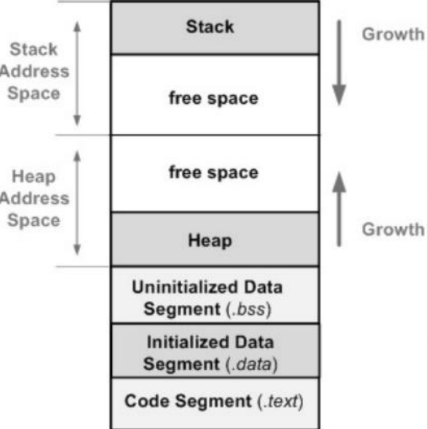

# 1. Biến
- Biến địa diện cho một vùng nhớ lưu trữ dữ liệu, giá trị trong đấy có thể thay đổi được kích thước, kiểu dữ liệu được xác định sẵn khi khởi tạo 
# 2. Store Class in C
- Trong C, các lớp lưu trữ xác định Timelife, Scope và Variable in memory của biến.
    + Timelife of a variable: thời gian tồn tại của biến 
    + Scope of va variable: Vùng hoạt động của biến 
    + Variable in memory: các vùng nhớ code, global & static objects, heap, stack
    
# 3. Global and Local Variable Discriminative
- Global: 
    + Được khởi tạo bên ngoài các hàm 
    + Scope: có thể truy cập ở toàn bộ chương trình 
    + TimeLife: trong suốt thời gian chương trình hoạt động
    + Memory: được lưu trữ trong Initialized Data(DS) và Uninitalized Data(BSS)
- Local: 
    + Được khởi tạo ở trong hàm 
    + Scope: có thể truy cập ở trong hàm đã khai báo chính nó 
    + Timelife: trong thời gian hàm hoạt động 
    + Memory: RAM (Stack)

# 4. KeyWord for Variable 
- Static: 
    + Static global variable: chỉ được truy cập trong 1 file obj/source 
    + Staticc local variable: tồn tại trong thời gian chạy của chương trình 
    + Timelife thay đổi nhưng scope không thay đổi
- Exterm:
    + Là tham chiếu của một biến, hàm cùng tên nào đó đã được định nghĩa bên ngoài. Nó chỉ khai báo chứ không định nghĩa(Cấp phát bộ nhớ cho biến)
    + Biến được tham chiếu phải được khai báo ở cấp độ cao nhất(toàn cục) và có thể nằm trong file khác
- Register: 
    + Register thông báo với compiler biến được khai báo ở CPU Register thay vì memory
    + thời gian truy cập nhanh hơn nhưng khó debug hơn vì không lấy được địa chỉ của biến 
- Volatile: 
    + volatile thông báo với trình biên dịch rằng vùng nhớ đấy có thể thay đổi giá trị nên cần theo dõi
    + memory-mapped peripheral register(thanh ghi ngoại vi có ánh xạ đến ô nhớ)
    + Biến toàn cục được truy xuất từ các chương trình con xử lý ngắn (interrup service routine)
    + Biến toàn cục được truy xuất từ nhiều tác vụ trong một ứng dụng đa luồng (mutil threads)
# 5. Pointer
- Pointer là một biến lưu địa chỉ của một biến khác 
# 6. Struct 
- Struct là một cách để nhóm một số biến có liên quan đến nhau. Mỗi biến ở trong struct được gọi là biến thành phần của struct.
# 7. Union 
- union là kiểu dữ liệu do người dùng định nghĩa có thể chứa các phần tử của các kiểu dữ liệu khác nhau giống như structure. Nhưng không giống như structures, tất cả các thành viên trong union C được lưu trữ trong cùng một vị trí bộ nhớ. Do đó, chỉ có một thành viên có thể lưu trữ dữ liệu tại thời điểm nhất định.

 

