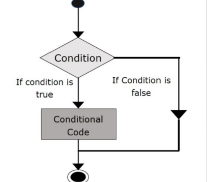
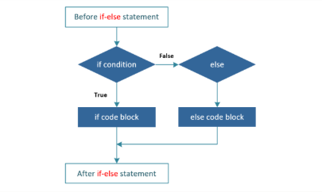
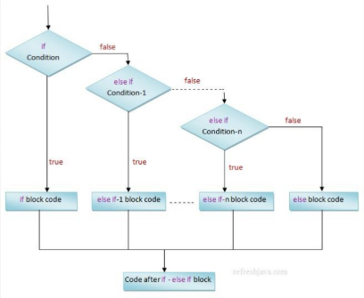
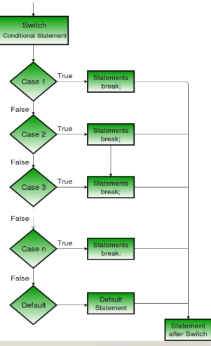

# 1. Array 
- Mỗi phần tử ở trong mảng được xác định bằng chỉ số duy nhất hoặc chỉ số dưới được gán cho nó
- Kích thước của một mảng được xác định bởi só lượng chỉ số cần thiết để xác định duy nhất từng phần tử 
- Chỉ số nguyên dương được đặt trong dấu [] ngay sau tên mảng.
- Là một chuỗi các phần tử có cùng kiểu dữ liệu 
# 2. Decision 
- Introduce: 
- If, Else statement: 

- Switch statement: 

# 3. Looping
- Vòng lặp While: Lặp lại một hoặc một nhóm các lệnh trong khi điều kiện đã cho là đúng. Nó kiểm tra điều kiện trước khi thực hiện thân vòng lặp.
- Vòng lặp for: Thực thi một dãy các lệnh nhiều lần và tóm tắt đoạn code mà quản lý biến vòng lặp.
- Vòng lặp do...while: Giống lệnh While, ngoại trừ ở điểm là nó kiểm tra điều kiện ở cuối thân vòng lặp.
- Lồng các vòng lặp: Bạn có thể sử dụng một hoặc nhiều vòng lặp trong các vòng lặp while, for hoặc do..while khác.

