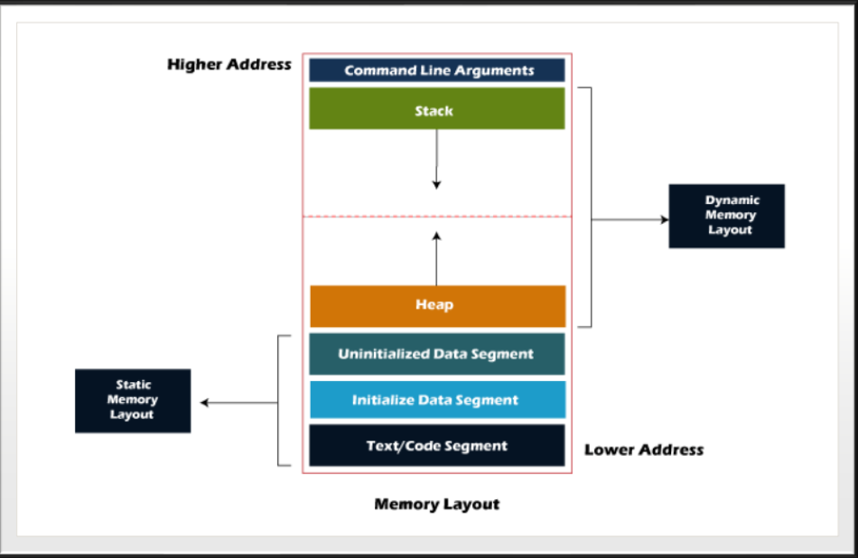
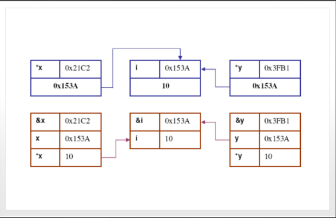

# 1. Build process overview
- Tiền xử lý:
    + macro expansion: mở rộng #define macro. Bao gồm tệp: Xử lý các chỉ thị #include bằng cách include các header file.
    + conditional compilation (biên dịch có điều kiện): Xử lý các điều kiện #if, #ifdef, #else và #endif. 
    + đầu ra là tệp đã được xử lý trước (file.i), macro expanded và include đã được giải quyết.
- Biên dịch: 
    + trình biên dịch chuyển đổi mã C đã được tiền biên dịch thành code assembly cho một kiến trúc cụ thể. Bước này cũng thực hiện kiểm tra cú pháp và tối ưu hóa.
    + đầu ra là file assembly (.s)
- Assembly: 
    + Trình biên dịch chuyển đổi mã assembly thành mã máy (nhị phân). 
    + đầu ra thường là các file object(.o hoặc .obj).
- Linking: 
    + Trình liên kết kết hợp các tệp đối tượng và thư viện thành một tệp thực thi duy nhất. 
    + Nó giải quyết các tham chiếu đến các hàm và đảm bảo tất cả các thư viện cần thiết đều được include.
    + Static linking: kết hợp các thư viện vào tệp thực thi tại thời điểm xây dựng (build time).
    + Dynamic linking: liên kết các shared libraries (like .so or .ddl) tại run time.
    + Trình liên kết cũng sắp sếp mọi thứ (data, function, etc) vào memory locations và chuẩn bị tệp thực thi cuối cùng (file exacute).
    + Đầu ra: file exacute (.exe)
- Thực thi: 
    + Bây giờ tệp thực thi có thể chạy trên hệ thống. Khi được thực thi,
    hệ điều hành sẽ tải chương trình vào bộ nhớ và bắt đầu thực thi chương trình.  

# 2. Memory layout 

# 3. Variable and memory location
- Mã của mỗi tệp C tạo ra phần .text
- Dữ liệu chỉ đọc tạo ra phần .rodata
- Dữ liệu được khởi tạo khác không tạo ra phần .data
- Phần dữ liệu được khởi tạo bằng không tạo ra phần .bss
- Dữ liệu không được khởi tạo tạo ra phần
COMMON
- Một số trình biên dịch chỉ tạo ra phần .bss
nối cả .bss và COMMON

# 4. Linker file and memory 
(Cụ thể hơn ở phần MCU).

# 5. Pointer in C

## 5.1. Overview of pointer in C

- Kích thước của con trỏ trong C và C++ phụ thuộc vào kiến trúc và nền tảng của hệ thống, không phải loại dữ liệu mà nó trỏ đến. Tất cả các con trỏ trên một hệ thống nhất định có cùng kích thước vì chúng lưu trữ một địa chỉ bộ nhớ, được xác định bởi không gian địa chỉ của hệ thống.
    + hệ thống 32 bit: con trỏ thường là 4 byte (32 bits), địa chỉ không gian giới hạn là 2^32 (4GB).
    + hệ thống 64 bit: con trỏ thường là 8 byte (64 bits), địa chỉ không gian giới hạn là 2^64 (8GB).
    + trường hợp đặc biệt: trên vài hệ thống nhúng hoặc kiến trúc hiếm, con trỏ có thể là 2 byte hoặc không cố định.

- Bản thân con trỏ giữ một địa chỉ bộ nhớ và kích thước của con trỏ phụ thuộc vào phạm vi bộ nhớ có thể định địa chỉ của hệ thống, không phụ thuộc vào kiểu dữ liệu. Trình biên dịch sử dụng thông tin kiểu để xác định lượng bộ nhớ cần giải tham chiếu khi sử dụng con trỏ.
## 5.2. Types of advanced pointers

- Con trỏ đến con trỏ:
    + Định nghĩa: Con trỏ giữ địa chỉ của con trỏ khác.
    + Ví dụ: int **ptr; – con trỏ đến con trỏ đến số nguyên.
    + Cách sử dụng: Cho phép thao tác động các vị trí bộ nhớ (ví dụ: khi truyền mảng đa chiều hoặc sửa đổi
    giá trị con trỏ trong các hàm).

- Con trỏ đến một Mảng:
    + Định nghĩa: Một con trỏ trỏ đến phần tử đầu tiên của một mảng.
    + Ví dụ: int (*arr_ptr)[5]; – một con trỏ đến một mảng gồm 5 số nguyên.
    + Cách sử dụng: Giúp truyền mảng cho các hàm hoặc phân bổ bộ nhớ động cho các mảng.

- Con trỏ đến một hàm:
    + Định nghĩa: Một con trỏ giữ địa chỉ của một hàm.
    + Ví dụ: int (*func_ptr)(int, int); – một con trỏ đến một hàm lấy hai số nguyên làm đối số và trả về một số nguyên.
    + Cách sử dụng: Hữu ích để triển khai các hàm gọi lại, lập trình hướng sự kiện hoặc truyền các hàm làm đối số cho các
    hàm khác.

## 5.3. Dynamic memory allocation with pointers
- malloc() – Phân bổ một số byte được chỉ định.
    + ptr = (cast_type*)malloc(byte_size)
    + ptr là con trỏ lưu trữ ô nhớ đầu tiên của vùng nhớ được phát hiện
    + cast_type* là kiểu con trỏ mà bạn muốn ép kiểu sang
    + byte_size là kích thước theo byte mà bạn muốn cấp
- calloc() – Cấp phát bộ nhớ và khởi tạo nó về 0.
    + ptr là con trỏ lưu trữ ô nhớ đầu tiên của vùng nhớ được phát hiện
    + cast_type* là kiểu con trỏ mà bạn muốn ép kiểu sang
    + n là số lượng phần tử bạn muốn phát
    + element_size là kích thước byte của 1 phần tử
- realloc() – Thay đổi kích thước bộ nhớ được phân bổ trước đó.
    + ptr = (cast_type*)realloc(ptr, new_size)
- free() – Giải phóng bộ nhớ để tránh rò rỉ bộ nhớ.

## 5.4. Pointer Arithmetic
- p++: di chuyển con trỏ đến phần tử tiếp theo.
- p--: di chuyển con trỏ đến phần tử trước đó. 
- So sánh con trỏ có bằng nhau hay khác nhau không.
- ptr1 == ptr2: kiểm tra 2 con trỏ có cùng trỏ tới một địa chỉ hay không.

- Biểu diễn con trỏ: mảng đa chiều có thể truy cập bằng con trỏ nhưng hành vi lập chỉ mục sẽ thay đổi.

## 5.5. Function pointer and callbacks

## 5.6. Advanced  pointer topics

- void pointers: kiểu con trỏ có thể chứa địa chỉ của bất kỳ kiểu dữ liệu nào 
    + ví dụ: void *ptr
    + sử dụng khi chưa biết kiểu dữ liệu hoặc chung
- pointer to constant: một con trỏ trỏ tới hằng số
    + ví dụ: const int *ptr
- constant pointer: một con trỏ có địa chỉ không thể thay đổi,nhưng giá trị tại địa chỉ đó có thể được sửa đổi
    + ví dụ: int const *ptr

## 5.7. Poiter casting (ép kiểu con trỏ)
- Chuyển đổi con trỏ trong C cho phép bạn diễn giải lại hoặc chuyển đổi một con trỏ từ kiểu này sang kiểu khác. Nó thường được sử dụng để xử lý các con trỏ chung (void*), thao tác bộ nhớ hoặc giao tiếp với phần cứng và thư viện.

- Rủi ro khi ép kiểu con trỏ:
    + Giải thích sai kiểu dữ liệu khi ép kiểu giữa các loại không tương thích.
    + Lỗi căn chỉnh bộ nhớ có thể gây lỗi chương trình trên các kiến trúc khác nhau.
    + Vấn đề về tính di động giữa các nền tảng.
- Ép kiểu khi làm việc với bộ nhớ:

    + Ép kiểu con trỏ giúp thao tác với bộ nhớ thô, như buffer hoặc mảng byte.
    +  Ví dụ về sao chép một int vào buffer và ép kiểu buffer về int*.
- Ép kiểu giữa các con trỏ tương thích:

    + Cho phép ép kiểu giữa các con trỏ có liên quan (vd: int* và long*).
    + Cần cẩn thận với kích thước kiểu dữ liệu để tránh lỗi không xác định.
- Ép kiểu void* về một kiểu cụ thể:

    + void* là con trỏ tổng quát có thể trỏ đến bất kỳ loại dữ liệu nào.
    + Khi sử dụng, cần ép kiểu về con trỏ phù hợp trước khi truy xuất giá trị.