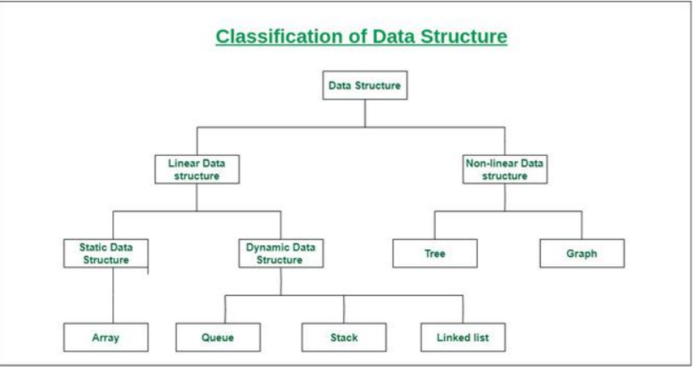

# 1. Data Structures

- Cấu trúc dữ liệu là một bộ lưu trữ sử dụng để xử lý, truy xuất, lưu trữ dữ liệu và tổ chức dữ liệu. Đây là một cách sắp xếp dữ liệu trên máy tính có thể truy cập và cập nhật dữ liệu một cách hiệu quả.
- list, arrays, stacks, queues or trees.

- Cấu trúc dữ liệu tuyến tính: cấu trúc dữ liệu trong đó các phần tử dữ liệu được sắp xếp tuần tự hoặc tuyến tính, trong đó mỗi phần tử được gắn với các phần tử liền kề trước và sau nó, được gọi là cấu trúc dữ liệu tuyến tính. Ví dụ: Mảng, ngăn xếp, hàng đợi, danh sách liên kết, v.v.

- Cấu trúc dữ liệu phi tuyến tính: Các cấu trúc dữ liệu mà các phần tử dữ liệu không được đặt tuần tự và tuyến tính được gọi là cấu trúc dữ liệu phi tuyến tính. Trong cấu trúc dữ liệu phi tuyến tính, chúng ta không thể duyệt tất cả các phần tử trong một lần chạy. Ví dụ: Cây và đồ thị. 

- Cấu trúc dữ liệu tĩnh: Cấu trúc dữ liệu tĩnh có kích thước bộ nhớ cố định. Dễ dàng truy cập các phần tử trong cấu trúc dữ liệu tĩnh. Ví dụ: mảng.

- Cấu trúc dữ liệu động: Trong cấu trúc dữ liệu động, kích thước không cố định. Nó có thể được cập nhật ngẫu nhiên trong thời gian chạy, điều này có thể được coi là hiệu quả liên quan đến độ phức tạp của bộ nhớ (không gian) của mã. Ví dụ: Hàng đợi, ngăn xếp.

# 2. Array 
- Array là một cấu trúc dữ liệu tuyến tính (linear data sttructure) chứa tập hợp các phần tử cùng kiểu dữ liệu. Các phần tử được nằm ở vùng nhớ liên tục (continuous memory) cho phép trong thời gian cố định (constant-time access). Mỗi phần tử có chỉ số duy nhất.
- Ưu điểm: 
    + Truy cập ngẫu nhiên (random access): ta có thể truy cập phần tử thứ i trong thời gian O(1) vì có địa chỉ cơ sở hoặc mọi mục tham chiếu đều cùng kích thước
    + Thân thiện với bộ nhớ đệm (cache friendliness): vì các mục/tham chiếu ở vị trí liền kề nên ta có lợi thế về vị trí tham chiếu.
- Nhược điểm: 
    + nó không hữu dụng ở những nơi chúng ta sử dụng thao tác chèn vào giữa, xóa hoặc tìm kiếm dữ liệu chưa được sắp xếp.
-> Đây là một cấu trúc dữ liệu cơ bản và tuyến tính mà dùng để xây dựng Stack queue, deque, graph, hash table, v.v.

- Giới hạn của array: 
    + các thao tác xóa, chèn làm tăng thời gian chạy của chương trình.
    + array có kích thước cố định. 

# 3. Matrix/Grid

- Matrix là một mảng 2 chiều được sắp xếp theo hàng và cột, nó được biểu diễn ở dạng hình chữ nhật các phần tử là giao điểm của các hàng và cột.

# 4. String
- Là chuỗi các ký tự, là đại diện cho các văn bản. 
- Là tập hợp nhỏ các phần tử

# 5. Stack 
- là cấu trúc dữ liệu tuyến tính theo dạng LIFO (last in first out). Stack đóng vai trò quan trọng trong quản lý function calls, memory và được sử dụng rộng rãi. *Stack* được thực hiện bằng mảng hoặc linked list.

- hai phương thức chính: 
    + `int push (stack s, void *item)` - Add item to the top of stack.
    + `void *pop(stack s)` - remove most recently pushed item from the top of stack.
- phương thức khác: 
    + `int IsEmpty(stack s)` - Xác minh xem stack có chứa gì không.
    + `void *Top(stack s)` - Trả lại item ở trên cùng mà không xóa nó.

# 6. Heap 

- Heaps được dựa trên khái niệm về cây hoàn chỉnh.

# 7.queue
- Queue là một cấu trúc dữ liệu tuyến tính theo nguyên tắc LIFO. Nó đóng vai trò quản lý tác vụ hoặc dữ liệu thứ tự, lập lịch và hệ thống xử lý tin nhắn 

# 8. Linked list 

- Là các phần tử đã được liên kết tạo thành danh sách. Là cấu trúc dữ liệu tuyến tính data chứa trong node và được kết nối bởi con trỏ.
- Nó chủ yếu cho phép các hoạt động chèn và xóa hiệu quả so với mảng. Giống như mảng, nó cũng được sử dụng để triển khai các cấu trúc dữ liệu như: stack, queue và deque.

|  | Linked list | Array |
|-------|-------|-------|
| Data Structure | non-contiguous | contiguous |
| memory allocation | typically allocated one by one to individual elements | typically allocated to the whole array |
| Inserttion/Deletion | Efficient | Inefficient |
| Access | Sequential | random | 

- Add first item: 
    + Phân bố không gian cho node
    + Đặt con trỏ dữ liệu của nó thành đối tượng 
    + Đặt Next thành Null 
    + Đặt Head để trỏ tới node mới
